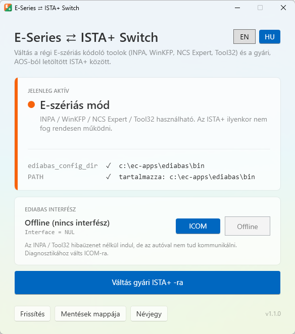

<p align="center">
  
</p>

<h1 align="center">E-Series ⇄ ISTA+ Switch</h1>

<p align="center">
  <b>Egy kattintással válthatsz ugyanazon a Windowsos gépen a régi BMW E-szériás kódoló toolok és a gyári BMW ISTA+ között.</b>
</p>

<p align="center">
  🇬🇧 <a href="README.md">English README</a>
</p>

<p align="center">
  
</p>

---

## A probléma

Sok BMW-szerelő és hobbista ugyanazon a laptopon használja mindkét diagnosztikai rendszert:

| | Régi „Standard Tools” | Gyári ISTA+ |
|---|---|---|
| **Programok** | EDIABAS, INPA, WinKFP, NCS Expert, Tool32 | ISTA+ (ISTA-D), a BMW AOS-ból (Aftersales Online System) letöltve |
| **Mire való** | **E-szériás** BMW-k diagnosztikája, kódolása és programozása (nagyjából a '90-es évek végétől a 2010-es évek közepéig, pl. E39, E46, E60/E61, E65, E70, E81–E88, E90–E93), valamint az ugyanebből a korszakból származó **R-szériás MINI-k** | A BMW hivatalos szervizdiagnosztikája E, F, G és újabb szériákhoz |
| **Mit igényel** | EDIABAS a **rendszer környezeti változóiban**: az `EDIABAS_CONFIG_DIR` változó és az EDIABAS `BIN` mappa a `PATH`-ban | **Ne** legyen rendszerszintű EDIABAS a környezeti változókban. Az ISTA+ saját EDIABAS-t hoz magával, és a globális zavarja |

A régi toolok tehát csak **a környezeti változókkal** működnek, az ISTA+ pedig csak **nélkülük** működik megbízhatóan. Eddig ezért minden autócserénél kézzel kellett átírni a rendszerváltozókat, vagy le kellett futtatni egy `.bat` szkriptet.

Az **ESeriesSwitch** ezt egy kattintással, biztonságosan elvégzi, és egy pillantással látod, melyik mód aktív.

> A régi toolok pontos típuslefedettsége az adatfájlok (SP-Daten) verziójától függ. F, G, I és U szériás autókhoz általában E-Sys vagy ISTA+ kell, így erre a programra csak akkor van szükséged, ha a régi toolokat is használod.

## Funkciók

- **Egyértelmű állapotjelzés**: 🟠 *E-szériás mód*, 🟢 *Gyári ISTA+ mód* vagy 🔴 *Részleges állapot* (a két beállításból csak az egyik van meg).
- **Váltás egy kattintással**, mindkét irányba.
- **Automatikus mentés** az előző értékekről minden módosítás előtt.
- **Biztonságos PATH-kezelés**: csak az EDIABAS-bejegyzést adja hozzá vagy veszi ki. A `PATH` többi része és a registry-típusa (`REG_EXPAND_SZ`) érintetlen marad, így a `%SystemRoot%\system32`-höz hasonló bejegyzések továbbra is működnek.
- **EDIABAS interfész váltása** ICOM és Offline között. Ez megelőzi a `NET-0009: TIMEOUT` hibát, ha nincs ICOM csatlakoztatva ([részletek lent](#ediabas-interfész-icom--offline)).
- **Újraindítás felajánlása** váltás után.
- **Figyelmeztetés**, ha hiányzik az EDIABAS mappa, vagy ha felhasználói szintű változók felülírhatják a rendszerszintűeket.
- **Angol és magyar** felület, bármikor átváltható.
- **Egyetlen hordozható `.exe`**. Nem kell telepíteni, és .NET sem kell hozzá.

## Követelmények

- Windows 10 vagy 11 (64 bites)
- Rendszergazdai jog. Az app rendszerszintű környezeti változókat módosít, ezért indításkor a Windows engedélyt kér (UAC).
- Meglévő EDIABAS-telepítés a régi toolokhoz, a `C:\EC-APPS\EDIABAS\BIN` vagy a `C:\EDIABAS\BIN` mappában

Tesztelve: Windows 11, EDIABAS 7.6.0, BMW AOS-ból letöltött ISTA+ és ICOM Next.

## Letöltés és használat

1. Töltsd le az `ESeriesSwitch.exe`-t a [**Releases**](https://github.com/brandonvers/ESeriesSwitch/releases) oldalról.
2. Tedd bárhova (Asztal, tools mappa vagy pendrive), és indítsd el. Hagyd jóvá a UAC-kérést.
3. Az állapotkártyán látod, melyik mód aktív.
4. Kattints a **Váltás E-szériás toolokra** vagy a **Váltás gyári ISTA+ -ra** gombra.
5. Ha az app felajánlja, indítsd újra a gépet. Az újonnan indított programok általában azonnal látják a változást, de az újraindítás biztosítja, hogy minden program és háttérszolgáltatás (főleg az ISTA+) átvegye.

> **Windows SmartScreen:** az első indításnál figyelmeztethet, mert az exe nincs digitálisan aláírva. Kattints a *További információ* → *Futtatás mindenképp* lehetőségre.

## Hogyan működik?

Az app a rendszer környezeti változóit módosítja a registryben:
`HKEY_LOCAL_MACHINE\SYSTEM\CurrentControlSet\Control\Session Manager\Environment`

| Mód | `EDIABAS_CONFIG_DIR` | `PATH` |
|---|---|---|
| **E-szériás toolok** | az EDIABAS `BIN` mappára állítja | az EDIABAS `BIN` mappát a végére fűzi |
| **Gyári ISTA+** | törli | minden ismert EDIABAS `BIN` bejegyzést kivesz |

**Melyik EDIABAS mappát használja:**
1. A meglévő `EDIABAS_CONFIG_DIR` változóban lévő mappát, ha az létezik
2. Különben a `c:\ec-apps\ediabas\bin` mappát, ha létezik
3. Különben a `C:\EDIABAS\BIN` mappát

**Minden váltásnál:**
1. JSON-fájlba menti a jelenlegi `PATH`-t (a registry-típusával együtt) és az `EDIABAS_CONFIG_DIR` értékét.
2. Csak a fenti két értéket módosítja.
3. Kiküld egy `WM_SETTINGCHANGE` („Environment”) értesítést, hogy az Explorer és az újonnan indított programok megkapják az új értékeket.
4. Felajánlja az újraindítást.

A Windowsban a környezeti változók nevei és az útvonalak nem kis- és nagybetűérzékenyek. A változót `ediabas_config_dir` néven írja az app, ez ugyanaz a változó, mint az `EDIABAS_CONFIG_DIR`.

## EDIABAS interfész (ICOM / Offline)

Az `EDIABAS.INI` `Interface` sora határozza meg, milyen diagnosztikai interfészt használjon az EDIABAS. ICOM-hoz ez `RPLUS:ICOM_P`. Ilyenkor **az INPA és a Tool32 már indításkor az ICOM-ot keresi**. Ha nincs ICOM csatlakoztatva, kb. 20 másodperc után ezt a hibát kapod:

```
ApiInit: Error #159
NET-0009: TIMEOUT
API initialization error
```

Az *EDIABAS interfész* kártya mutatja a jelenlegi beállítást, és egy kattintással átváltja:

| Gomb | Beírt érték | Mikor használd |
|---|---|---|
| **ICOM** | `RPLUS:ICOM_P` | Az ICOM az autón van. Diagnosztika, kódolás, programozás |
| **Offline** | `NUL` | Nincs ICOM csatlakoztatva. Az INPA / Tool32 hibaüzenet nélkül indul, de nem kommunikál az autóval |

- Az INI-t az app **csak** akkor módosítja, ha e két gomb egyikére kattintasz. A módváltás soha nem nyúl hozzá.
- A `[Configuration]` részben csak ennek az egy sornak az értékét cseréli le. A fájl többi része bájtra pontosan változatlan marad.
- Minden módosítás előtt másolatot ment az INI-ről a mentések mappájába.
- A változás az INPA vagy a Tool32 következő indításakor lép életbe, újraindítás nem kell hozzá.

> Ha ICOM helyett **K+DCAN kábelt** (`STD:OBD`) vagy **ENET-et** használsz, a kártya *Egyéb interfész*-t mutat. Ilyenkor ne használd a két gombot, mert ICOM-ra vagy NUL-ra írnák át a beállításodat.

## Mit módosít az app, és mihez nem nyúl

**Módosítja:**
- az `EDIABAS_CONFIG_DIR` rendszerváltozót
- az EDIABAS `BIN` bejegyzést a rendszer `PATH`-ban
- az `EDIABAS.INI` `Interface` sorát, de **csak** az *ICOM* / *Offline* gombra kattintva

**Létrehozza:**
- a mentésfájlokat és a `settings.json`-t (a választott nyelvvel) itt: `C:\ProgramData\ESeriesSwitch\`

**Soha nem nyúl hozzá:**
- a felhasználói szintű környezeti változókhoz (ezeket csak olvassa, és figyelmeztet)
- az ISTA+-hoz, INPA-hoz, WinKFP-hez, NCS Experthez és ezek fájljaihoz
- az `EDIABAS.INI` többi részéhez és a `C:\EC-APPS` többi fájljához
- a hálózati beállításokhoz, az ICOM-hoz és a Windows-szolgáltatásokhoz

## Mentések és visszaállítás

A mentések helye: `C:\ProgramData\ESeriesSwitch\Backups\`. A **Mentések mappája** gombbal nyithatod meg.

- `backup_ÉÉÉÉHHNN_ÓÓPPMM.json`: a környezeti változók állapota **a váltás előtt**: `Path`, `PathKind`, `EdiabasConfigDir`.
- `EDIABAS_ÉÉÉÉHHNN_ÓÓPPMM.INI`: az `EDIABAS.INI` másolata **az interfész módosítása előtt**.

**A környezeti változók kézi visszaállítása:**
1. Nyisd meg a *Rendszer tulajdonságai* → *Környezeti változók…* ablakot (vagy futtasd rendszergazdaként a `rundll32 sysdm.cpl,EditEnvironmentVariables` parancsot).
2. A *Rendszerváltozók* között szerkeszd a `Path` értékét: kattints a *Szöveg szerkesztése…* gombra, és illeszd be a mentésfájl `Path` értékét.
3. Állítsd be vagy töröld az `EDIABAS_CONFIG_DIR` változót a mentésben lévő `EdiabasConfigDir` szerint.

**Az `EDIABAS.INI` kézi visszaállítása:** másold vissza a mentett `.INI` fájlt az EDIABAS `BIN` mappába, és nevezd át `EDIABAS.INI`-re.

## Hibaelhárítás

| Tünet | Ok és megoldás |
|---|---|
| `NET-0009: TIMEOUT` az INPA / Tool32 indításakor | Az EDIABAS ICOM-ra van állítva, de nincs ICOM csatlakoztatva, vagy az ISTA+ még lefoglalva tartja. Csatlakoztasd az ICOM-ot (gyújtás ráadva), vagy kattints az **Offline** gombra. Ha előtte ISTA+-t használtál, oldd fel az ICOM foglalását az ITool Radarban, vagy húzd ki kb. 10 másodpercre. |
| Az ISTA+ hibásan működik az ISTA+ módra váltás után | Indítsd újra a gépet, hogy minden folyamat és szolgáltatás a tiszta környezettel induljon. |
| Egy tool még a régi beállítást látja | A már futó programok a régi környezetet tartják meg. Indítsd újra a programot vagy a gépet. |
| Figyelmeztetés a felhasználói változókról | Az `EDIABAS_CONFIG_DIR` vagy az EDIABAS mappa a **felhasználói** változók között is szerepel, és felülírhatja a rendszerszintűt. Töröld kézzel: *Környezeti változók* → *Felhasználói változók*. |

## Fordítás forráskódból

- Visual Studio 2026 („.NET desktop development” csomaggal) vagy .NET 10 SDK
- WPF, .NET 10, C#

```bash
git clone https://github.com/brandonvers/ESeriesSwitch.git
cd ESeriesSwitch
dotnet build
```

Egyetlen, önálló exe készítése (a kimenet: `bin\publish\ESeriesSwitch.exe`):

```bash
dotnet publish -p:PublishProfile=FolderProfile
```

Visual Studióban: jobb klikk a projekten → **Publish…** → **FolderProfile** → **Publish**.
Az app rendszergazdai jogot igényel, ezért F5-tel debugoláshoz rendszergazdaként indítsd a Visual Studiót.

## Felelősségkizárás

> **A program használata kizárólag saját felelősségre történik.**
>
> A program „ahogy van” alapon, mindennemű kifejezett vagy hallgatólagos garancia nélkül érhető el. A szerző **semmilyen felelősséget nem vállal** a program használatából vagy helytelen használatából eredő közvetlen vagy közvetett károkért. Ide tartoznak többek között a járművekben, vezérlőegységekben (ECU), diagnosztikai interfészekben, számítógépekben, szoftvertelepítésekben vagy adatokban keletkező károk, valamint az adatvesztés és a kiesett munkaidő.
>
> A járműveken végzett diagnosztikai, kódolási és programozási műveletek hibás végrehajtás esetén véglegesen károsíthatják a vezérlőegységeket. Ez a program csak Windows-beállításokat módosít, de a te felelősséged tudni, mit csinálnak az utána futtatott diagnosztikai programok. Mindig készíts saját mentést.

## Védjegyek

Ez a projekt független, nem hivatalos program. **Nem kapcsolódik a BMW AG-hez** vagy leányvállalataihoz, és azok nem támogatják, nem szponzorálják és nem hagyják jóvá.
A BMW, MINI, ISTA, INPA, WinKFP, NCS Expert, EDIABAS, ICOM és AOS nevek a jogtulajdonosaik védjegyei vagy terméknevei. Itt kizárólag azonosítási célból szerepelnek.
A tároló **nem** tartalmaz BMW-szoftvert, adatfájlokat vagy más, jogvédett anyagot.

## Licenc

[MIT](LICENSE) © 2026 Brendon Scheiber. A licenc hivatalos szövege angol nyelvű.

## Verziók

- **1.1.0**
  - Angol és magyar felület, nyelvváltóval
  - Az EDIABAS mappa automatikus felismerése (`c:\ec-apps\ediabas\bin` vagy `C:\EDIABAS\BIN`)
  - ISTA+-ra váltáskor minden ismert EDIABAS-bejegyzés kikerül a `PATH`-ból
  - Névjegy ablak a licenccel és a felelősségkizárással
- **1.0.1**: EDIABAS interfész (ICOM / Offline) kijelzése és váltása
- **1.0.0**: első verzió, váltás az E-szériás toolok és az ISTA+ között
