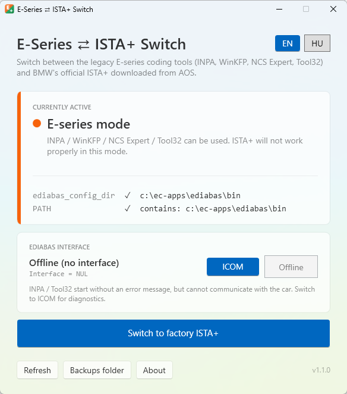

<p align="center">
  
</p>

<h1 align="center">E-Series ⇄ ISTA+ Switch</h1>

<p align="center">
  <b>One-click switching between the legacy BMW E-series coding tools and the official BMW ISTA+ on the same Windows PC.</b>
</p>

<p align="center">
  🇭🇺 <a href="README.hu.md">Magyar leírás / Hungarian README</a>
</p>

<p align="center">
  
</p>

---

## The problem

Many BMW technicians and enthusiasts keep two diagnostic worlds on one laptop:

| | Legacy "Standard Tools" | Factory ISTA+ |
|---|---|---|
| **Programs** | EDIABAS, INPA, WinKFP, NCS Expert, Tool32 | ISTA+ (ISTA-D), downloaded from BMW AOS (Aftersales Online System) |
| **Used for** | Diagnostics, coding and programming of **E-series** BMWs (roughly the late 1990s to the mid-2010s, e.g. E39, E46, E60/E61, E65, E70, E81–E88, E90–E93) and the **R-series MINIs** of the same era | BMW's official workshop diagnostic system for E, F, G and newer series |
| **Needs** | EDIABAS in the **system environment**: the `EDIABAS_CONFIG_DIR` variable and the EDIABAS `BIN` folder in `PATH` | **No** system-wide EDIABAS in the environment. ISTA+ ships its own EDIABAS, and a global one interferes with it |

So the legacy tools only work **with** the environment variables, and ISTA+ only works reliably **without** them. Until now that meant editing the system environment variables by hand or running a batch script every time you changed cars.

**ESeriesSwitch** does this with one click, safely, and shows you at a glance which mode is active.

> The exact vehicle coverage of the legacy tools depends on the version of your data files (SP-Daten). For F, G, I and U series cars you normally use E-Sys or ISTA+, so this tool is only relevant if you also use the legacy tools.

## Features

- **Clear status**: 🟠 *E-series mode*, 🟢 *Factory ISTA+ mode* or 🔴 *Partial state* (only one of the two settings is present).
- **One-click switching** in both directions.
- **Automatic backup** of the previous values before every change.
- **Safe PATH handling**: only the EDIABAS entry is added or removed. The rest of `PATH` and its registry type (`REG_EXPAND_SZ`) are left untouched, so entries like `%SystemRoot%\system32` keep working.
- **EDIABAS interface toggle** between ICOM and Offline, which avoids the `NET-0009: TIMEOUT` error when no ICOM is connected ([details below](#ediabas-interface-icom--offline)).
- **Restart offer** after switching.
- **Warnings** if the EDIABAS folder is missing or if user-level variables could override the system ones.
- **English and Hungarian** user interface, switchable at any time.
- **Update notification**: on startup the app checks GitHub for a newer release and shows a *Download* button if there is one.
- A **single portable `.exe`**. No installation and no .NET runtime needed.

## Requirements

- Windows 10 or 11 (64-bit)
- Administrator rights. The app changes system-wide environment variables, so Windows asks for permission (UAC) when it starts.
- An existing EDIABAS installation for the legacy tools, in `C:\EC-APPS\EDIABAS\BIN` or `C:\EDIABAS\BIN`

Tested with Windows 11, EDIABAS 7.6.0, ISTA+ from BMW AOS and an ICOM Next.

## Download and usage

1. Download `ESeriesSwitch.exe` from the [**Releases**](https://github.com/brandonvers/ESeriesSwitch/releases) page.
2. Put it anywhere (desktop, tools folder or USB stick) and run it. Confirm the UAC prompt.
3. Read the current mode on the status card.
4. Click **Switch to E-series tools** or **Switch to factory ISTA+**.
5. Restart the computer when offered. Newly started programs usually see the change right away, but a restart makes sure that every program and background service (especially ISTA+) picks it up.

> **Windows SmartScreen** may warn you on the first start because the exe is not code-signed. Click *More info* → *Run anyway*.

## How it works

The app works on the system environment variables in the registry:
`HKEY_LOCAL_MACHINE\SYSTEM\CurrentControlSet\Control\Session Manager\Environment`

| Mode | `EDIABAS_CONFIG_DIR` | `PATH` |
|---|---|---|
| **E-series tools** | set to the EDIABAS `BIN` folder | EDIABAS `BIN` folder appended to the end |
| **Factory ISTA+** | removed | all known EDIABAS `BIN` entries removed |

**Which EDIABAS folder is used:**
1. The folder in the existing `EDIABAS_CONFIG_DIR` variable, if that folder exists
2. Otherwise `c:\ec-apps\ediabas\bin`, if it exists
3. Otherwise `C:\EDIABAS\BIN`

**Every switch:**
1. Saves the current `PATH` (with its registry type) and `EDIABAS_CONFIG_DIR` to a JSON backup file.
2. Changes only the two values above.
3. Broadcasts `WM_SETTINGCHANGE` ("Environment") so that Explorer and newly started programs get the new values.
4. Offers a restart.

Environment variable names and paths are case-insensitive on Windows. The variable is written as `ediabas_config_dir`, which is the same variable as `EDIABAS_CONFIG_DIR`.

## EDIABAS interface (ICOM / Offline)

The `Interface` line in `EDIABAS.INI` tells EDIABAS which diagnostic interface to use. With an ICOM this is `RPLUS:ICOM_P`. In that setting, **INPA and Tool32 look for the ICOM as soon as they start**. If no ICOM is connected, you get this error after about 20 seconds:

```
ApiInit: Error #159
NET-0009: TIMEOUT
API initialization error
```

The *EDIABAS interface* card shows the current setting and switches it with one click:

| Button | Value written | When to use it |
|---|---|---|
| **ICOM** | `RPLUS:ICOM_P` | ICOM connected to the car. Diagnostics, coding, programming |
| **Offline** | `NUL` | No ICOM connected. INPA / Tool32 start without the error, but cannot talk to the car |

- The INI is **only** changed when you click one of these buttons. Switching modes never touches it.
- Only the value of this single line in the `[Configuration]` section is replaced. The rest of the file stays byte-for-byte identical.
- A copy of the INI is saved to the backups folder before every change.
- The change takes effect the next time INPA or Tool32 starts. No restart is needed.

> If you use a **K+DCAN cable** (`STD:OBD`) or **ENET** instead of an ICOM, the card shows *Other interface*. Don't use the two buttons in that case, because they would replace your setting with ICOM or NUL.

## What the app changes and what it does not

**Changes:**
- the system variable `EDIABAS_CONFIG_DIR`
- the EDIABAS `BIN` entry in the system `PATH`
- the `Interface` line in `EDIABAS.INI`, **only** when you click *ICOM* or *Offline*

**Creates:**
- backup files and `settings.json` (the chosen language) in `C:\ProgramData\ESeriesSwitch\`

**Never touches:**
- user-level environment variables (it only reads them and warns you)
- ISTA+, INPA, WinKFP, NCS Expert or any of their files
- the rest of `EDIABAS.INI` and of `C:\EC-APPS`
- network settings, the ICOM or Windows services

**Network:** the only connection the app makes is the update check, a single request to `api.github.com` on startup that reads the latest release number. No data about you or your PC is sent, and nothing is downloaded automatically. If the PC is offline, the check is skipped silently.

## Backups and restoring

Backups are stored in `C:\ProgramData\ESeriesSwitch\Backups\`. Open this folder with the **Backups folder** button.

- `backup_YYYYMMDD_HHMMSS.json` contains the environment **before** a switch: `Path`, `PathKind` and `EdiabasConfigDir`.
- `EDIABAS_YYYYMMDD_HHMMSS.INI` contains a copy of `EDIABAS.INI` **before** an interface change.

**Manual restore of the environment:**
1. Open *System Properties* → *Environment Variables…* (or run `rundll32 sysdm.cpl,EditEnvironmentVariables` as administrator).
2. Under *System variables*, edit `Path`, click *Edit text…* and paste the `Path` value from the backup file.
3. Set or delete `EDIABAS_CONFIG_DIR` to match `EdiabasConfigDir` from the backup.

**Manual restore of `EDIABAS.INI`:** copy the backup `.INI` file back to the EDIABAS `BIN` folder and rename it to `EDIABAS.INI`.

## Troubleshooting

| Symptom | Cause and fix |
|---|---|
| `NET-0009: TIMEOUT` when INPA / Tool32 starts | EDIABAS is set to ICOM, but no ICOM is connected or the ICOM is still reserved by ISTA+. Connect the ICOM (ignition on) or click **Offline**. If ISTA+ was used before, release the ICOM in ITool Radar or unplug it for about 10 seconds. |
| ISTA+ misbehaves after switching to ISTA+ mode | Restart the computer so that every process and service starts with the clean environment. |
| A tool still sees the old setting | Programs that were already running keep their old environment. Restart the program or the computer. |
| Warning about user variables | `EDIABAS_CONFIG_DIR` or the EDIABAS folder is also set among your **user** variables, which can override the system ones. Remove it by hand under *Environment Variables* → *User variables*. |

## Building from source

- Visual Studio 2026 (".NET desktop development" workload) or the .NET 10 SDK
- WPF, .NET 10, C#

```bash
git clone https://github.com/brandonvers/ESeriesSwitch.git
cd ESeriesSwitch
dotnet build
```

Single-file, self-contained exe (the output goes to `bin\publish\ESeriesSwitch.exe`):

```bash
dotnet publish -p:PublishProfile=FolderProfile
```

In Visual Studio: right-click the project → **Publish…** → **FolderProfile** → **Publish**.
The app requires administrator rights, so start Visual Studio as administrator to debug it with F5.

## Disclaimer

> **Use this software entirely at your own risk.**
>
> This software is provided "as is", without warranty of any kind, express or implied. The author accepts **no liability whatsoever** for any direct or indirect damage, including damage to vehicles, control units (ECUs), diagnostic interfaces, computers, software installations or data, and including loss of data or downtime, arising from the use or misuse of this software.
>
> Diagnostic, coding and programming operations on vehicles can permanently damage control units if done incorrectly. This tool only changes Windows settings, but it is your responsibility to know what the diagnostic tools you run afterwards will do. Always make your own backups.

## Trademarks

This project is an independent, unofficial tool. It is **not affiliated with, endorsed, sponsored or supported by BMW AG** or any of its subsidiaries.
BMW, MINI, ISTA, INPA, WinKFP, NCS Expert, EDIABAS, ICOM and AOS are trademarks or product names of their respective owners. They are used here for identification purposes only.
This repository contains **no** BMW software, data files or other proprietary material.

## License

[MIT](LICENSE) © 2026 Brendon Scheiber

## Changelog

- **1.2.0**: update notification when a newer release is available on GitHub
- **1.1.0**
  - English and Hungarian user interface with a language switcher
  - Automatic detection of the EDIABAS folder (`c:\ec-apps\ediabas\bin` or `C:\EDIABAS\BIN`)
  - Switching to ISTA+ removes every known EDIABAS entry from `PATH`
  - About dialog with license and disclaimer
- **1.0.1**: EDIABAS interface (ICOM / Offline) display and toggle
- **1.0.0**: first release, switching between the E-series tools and ISTA+
